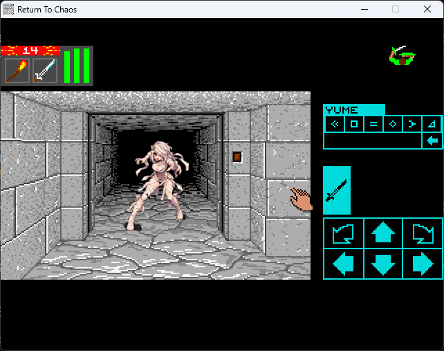
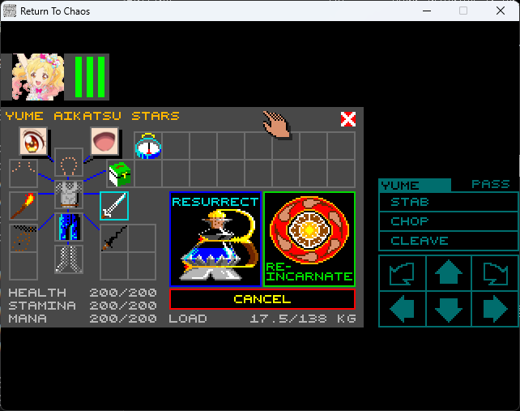
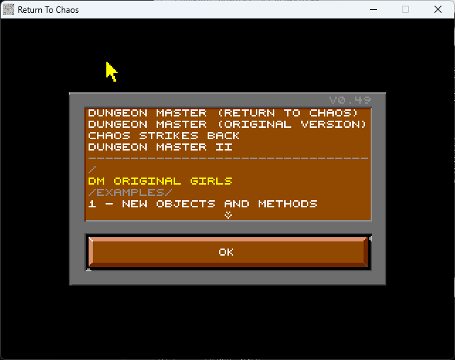

# RTC_BRY

久しぶりに「ダンジョンマスター」をやりたくなって[Dungeon Master - Return To Chaos](http://ragingmole.com/RTC/)からクローンゲームをDLしてみましたが、さすがに絵が古いのでやる気が出なかったので、ChatGPTの画像作成機能使って適当に作って
差し替えてみました。<br>
<br>
チャンピョン達は女性のみ。男性は面倒だったのでデフォルトのまま。<br>
モンスターは女の子擬人化してみました。<br>

<br>
チャンピョンのHALKとZEDは名前を変えてデバッグ用にパラメータを最強にしています。性別も女性に。其の為「生まれ変わらせる」すると逆に成長しない弱いキャラクタになるので注意です。<br>
他の女性キャラも少しパラメータを強化していますので、基本的に「生まれ変わらせる」をしないほうが良いです。<br>

名前とか変えたいときは **DM_Original2.txt** を **RTCEditor.exe**で修正したほうが楽です。まぁテキストエディタで直接修正してもいいです。<br>
僕がレベル上げで時間費やすのに耐えきれなくなってるのである程キャラクタは強くしてあります。<br>

## DL
**Modules** フォルダに有る**DM_Original2.RTC**をDLか右上のReleasesからDLしてください。<br>
ソースをコンパイルしたい時はここをクローンした後に**RTC_V049**の中身とマージさせてください。


## 遊び方

1. [Dungeon Master - Return To Chaos](http://ragingmole.com/RTC/) から"Return To Chaos V0.49"をDLして適当の場所に展開。
2. ここにある **DM_Original2.RTC** を **Modules** フォルダにコピー。
3. RTC.exeを起動。
4. 表示されるメニューから **DM ORIGINAL GIRLS** を選んでOKを押す。
5. 後は普通に遊んでください。

**config.txt** を編集してウィンドウ表示とショートカットキーを別に指定したほうが遊びやすくなります。<br>
あと、チャンピョン一人旅のほうが最終的に楽になります。
```
FULLSCREEN		OFF

KEY_STEP_FORWARD	S
KEY_STEP_BACKWARD	X
KEY_TURN_LEFT		A
KEY_TURN_RIGHT		D
KEY_STEP_LEFT		Z
KEY_STEP_RIGHT		C

KEY_VIEW_CYCLE		Q
KEY_VIEW_CHAR_1		F1
KEY_VIEW_CHAR_2		F2
KEY_VIEW_CHAR_3		F3
KEY_VIEW_CHAR_4		F4

KEY_RUNE_CHAR_1		F5
KEY_RUNE_CHAR_2		F6
KEY_RUNE_CHAR_3		F7
KEY_RUNE_CHAR_4		F8
KEY_RUNE_1		1
KEY_RUNE_2		2
KEY_RUNE_3		3
KEY_RUNE_4		4
KEY_RUNE_5		5
KEY_RUNE_6		6
KEY_RUNE_DELETE		BACKSPACE
KEY_RUNE_CAST		RETURN
```
## ソースファイル
**DM_Original2.txt** はこのゲームのソースになります。ここにある**Modules** / **Portraits** フォルダの中身を、**RTC_V049** にマージすればコンパイルできるようになります。<br>
方法は **Editing.txt** に説明があります。


## Authors

bry-ful(Hiroshi Furuhashi)<br>
twitter:[bryful](https://twitter.com/bryful)<br>
